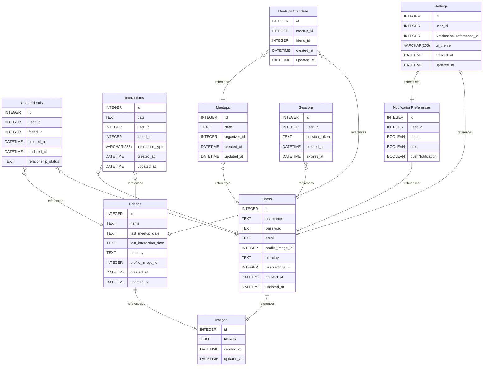

# myFriends v2 documentation
## Summary

- [myFriends v2 documentation](#myfriends-v2-documentation)
	- [Summary](#summary)
	- [Introduction](#introduction)
	- [Database type](#database-type)
	- [Table structure](#table-structure)
		- [Friends](#friends)
		- [UsersFriends](#usersfriends)
		- [Users](#users)
		- [Images](#images)
		- [Interactions](#interactions)
		- [Meetups](#meetups)
		- [MeetupsAttendees](#meetupsattendees)
		- [Settings](#settings)
		- [Sessions](#sessions)
		- [NotificationPreferences](#notificationpreferences)
	- [Relationships](#relationships)
	- [Database Diagram](#database-diagram)

## Introduction

## Database type

- **Database system:** SQLite
## Table structure

### Friends

| Name        | Type          | Settings                      | References                    | Note                           |
|-------------|---------------|-------------------------------|-------------------------------|--------------------------------|
| **id** | INTEGER | 🔑 PK, not null, unique |  | |
| **name** | TEXT | not null |  | |
| **last_meetup_date** | TEXT | null |  | |
| **last_interaction_date** | TEXT | null |  | |
| **birthday** | TEXT | null |  | |
| **profile_image_id** | INTEGER | null | fk_Friends_profile_image_id_Images | |
| **created_at** | DATETIME | null, default: CURRENT_TIMESTAMP |  | |
| **updated_at** | DATETIME | null, default: CURRENT_TIMESTAMP |  | | 

### UsersFriends

| Name        | Type          | Settings                      | References                    | Note                           |
|-------------|---------------|-------------------------------|-------------------------------|--------------------------------|
| **id** | INTEGER | 🔑 PK, not null, unique |  | |
| **user_id** | INTEGER | not null | fk_UsersFriends_user_id_Users | |
| **friend_id** | INTEGER | not null | fk_UsersFriends_friend_id_Friends | |
| **created_at** | DATETIME | null, default: CURRENT_TIMESTAMP |  | |
| **updated_at** | DATETIME | null, default: CURRENT_TIMESTAMP |  | |
| **relationship_status** | TEXT | null |  | | 

### Users

| Name        | Type          | Settings                      | References                    | Note                           |
|-------------|---------------|-------------------------------|-------------------------------|--------------------------------|
| **id** | INTEGER | 🔑 PK, not null, unique |  | |
| **username** | TEXT | not null |  | |
| **password** | TEXT | not null |  | |
| **email** | TEXT | null |  | |
| **profile_image_id** | INTEGER | null | fk_Users_profile_image_id_Images | |
| **birthday** | TEXT | null |  | |
| **usersettings_id** | INTEGER | null |  | |
| **created_at** | DATETIME | null, default: CURRENT_TIMESTAMP |  | |
| **updated_at** | DATETIME | null, default: CURRENT_TIMESTAMP |  | | 

### Images

| Name        | Type          | Settings                      | References                    | Note                           |
|-------------|---------------|-------------------------------|-------------------------------|--------------------------------|
| **id** | INTEGER | 🔑 PK, not null, unique |  | |
| **filepath** | TEXT | null |  | |
| **created_at** | DATETIME | null, default: CURRENT_TIMESTAMP |  | |
| **updated_at** | DATETIME | null, default: CURRENT_TIMESTAMP |  | | 

### Interactions

| Name        | Type          | Settings                      | References                    | Note                           |
|-------------|---------------|-------------------------------|-------------------------------|--------------------------------|
| **id** | INTEGER | 🔑 PK, not null, unique |  | |
| **date** | TEXT | not null |  | |
| **user_id** | INTEGER | not null | fk_Interactions_user_id_Users | |
| **friend_id** | INTEGER | not null | fk_Interactions_friend_id_Friends | |
| **interaction_type** | VARCHAR(255) | null |  | |
| **created_at** | DATETIME | null, default: CURRENT_TIMESTAMP |  | |
| **updated_at** | DATETIME | null, default: CURRENT_TIMESTAMP |  | | 

### Meetups

| Name        | Type          | Settings                      | References                    | Note                           |
|-------------|---------------|-------------------------------|-------------------------------|--------------------------------|
| **id** | INTEGER | 🔑 PK, not null, unique |  | |
| **date** | TEXT | null |  | |
| **organizer_id** | INTEGER | null | fk_Meetups_organizer_id_Users | |
| **created_at** | DATETIME | null, default: CURRENT_TIMESTAMP |  | |
| **updated_at** | DATETIME | null, default: CURRENT_TIMESTAMP |  | | 

### MeetupsAttendees

| Name        | Type          | Settings                      | References                    | Note                           |
|-------------|---------------|-------------------------------|-------------------------------|--------------------------------|
| **id** | INTEGER | 🔑 PK, not null, unique |  | |
| **meetup_id** | INTEGER | null | fk_MeetupsAttendees_meetup_id_Meetups | |
| **friend_id** | INTEGER | null | fk_MeetupsAttendees_friend_id_Friends | |
| **created_at** | DATETIME | null, default: CURRENT_TIMESTAMP |  | |
| **updated_at** | DATETIME | null, default: CURRENT_TIMESTAMP |  | | 

### Settings

| Name        | Type          | Settings                      | References                    | Note                           |
|-------------|---------------|-------------------------------|-------------------------------|--------------------------------|
| **id** | INTEGER | 🔑 PK, not null, unique |  | |
| **user_id** | INTEGER | null | fk_Settings_user_id_Users | |
| **NotificationPreferences_id** | INTEGER | null | fk_Settings_notificationPreferences_id_notificationPreferences | |
| **ui_theme** | VARCHAR(255) | null |  | |
| **created_at** | DATETIME | null, default: CURRENT_TIMESTAMP |  | |
| **updated_at** | DATETIME | null, default: CURRENT_TIMESTAMP |  | | 

### Sessions

| Name        | Type          | Settings                      | References                    | Note                           |
|-------------|---------------|-------------------------------|-------------------------------|--------------------------------|
| **id** | INTEGER | 🔑 PK, not null, unique |  | |
| **user_id** | INTEGER | not null | fk_Sessions_user_id_Users | |
| **session_token** | TEXT | not null |  | |
| **created_at** | DATETIME | null, default: CURRENT_TIMESTAMP |  | |
| **expires_at** | DATETIME | null |  | | 

### NotificationPreferences

| Name        | Type          | Settings                      | References                    | Note                           |
|-------------|---------------|-------------------------------|-------------------------------|--------------------------------|
| **id** | INTEGER | 🔑 PK, not null, unique, autoincrement |  | |
| **user_id** | INTEGER | null | fk_notificationPreferences_user_id_Users | |
| **email** | BOOLEAN | null |  | |
| **sms** | BOOLEAN | null |  | |
| **pushNotification** | BOOLEAN | null |  | | 

## Relationships

- **UsersFriends to Friends**: many_to_one
- **Interactions to Users**: many_to_one
- **Interactions to Friends**: many_to_one
- **Meetups to Users**: many_to_one
- **MeetupsAttendees to Meetups**: many_to_one
- **MeetupsAttendees to Friends**: many_to_one
- **Sessions to Users**: many_to_one
- **UsersFriends to Users**: many_to_one
- **Users to Images**: one_to_one
- **Friends to Images**: one_to_one
- **Settings to NotificationPreferences**: one_to_one
- **NotificationPreferences to Users**: one_to_one
- **Settings to Users**: one_to_one

## Database Diagram

