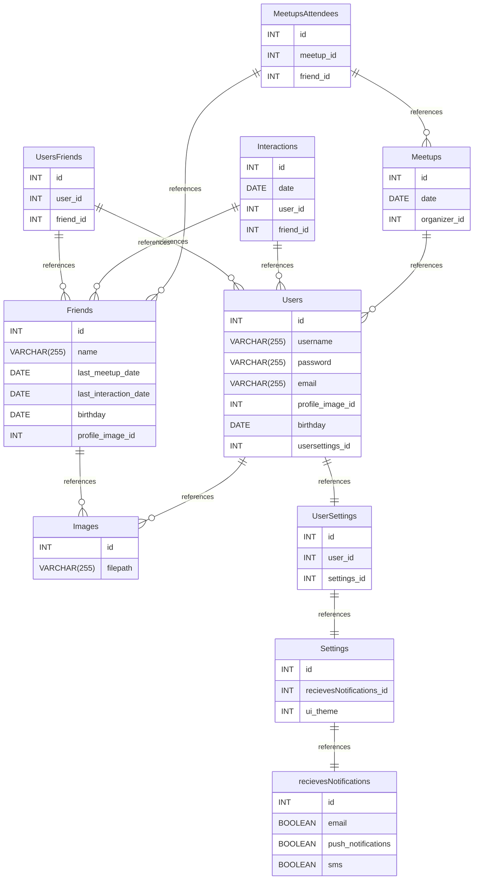

# myFriends documentation
## Summary

- [Introduction](#introduction)
- [Database Type](#database-type)
- [Table Structure](#table-structure)
	- [Friends](#friends)
	- [UsersFriends](#usersfriends)
	- [Users](#users)
	- [Images](#images)
	- [Interactions](#interactions)
	- [Meetups](#meetups)
	- [MeetupsAttendees](#meetupsattendees)
	- [Settings](#settings)
	- [UserSettings](#usersettings)
	- [recievesNotifications](#recievesnotifications)
- [Relationships](#relationships)
- [Database Diagram](#database-diagram)

## Introduction

## Database type

- **Database system:** Generic
## Table structure

### Friends

| Name        | Type          | Settings                      | References                    | Note                           |
|-------------|---------------|-------------------------------|-------------------------------|--------------------------------|
| **id** | INT | 🔑 PK, not null, unique |  | |
| **name** | VARCHAR(255) | not null |  | |
| **last_meetup_date** | DATE | null |  | |
| **last_interaction_date** | DATE | null |  | |
| **birthday** | DATE | null |  | |
| **profile_image_id** | INT | null | fk_Friends_profile_image_id_Images | | 

### UsersFriends

| Name        | Type          | Settings                      | References                    | Note                           |
|-------------|---------------|-------------------------------|-------------------------------|--------------------------------|
| **id** | INT | 🔑 PK, not null, unique, autoincrement |  | |
| **user_id** | INT | not null | fk_UsersFriends_users_id_Users | |
| **friend_id** | INT | not null | fk_UsersFriends_friend_id_Friends | | 

### Users

| Name        | Type          | Settings                      | References                    | Note                           |
|-------------|---------------|-------------------------------|-------------------------------|--------------------------------|
| **id** | INT | 🔑 PK, not null, unique, autoincrement |  | |
| **username** | VARCHAR(255) | not null |  | |
| **password** | VARCHAR(255) | not null |  | |
| **email** | VARCHAR(255) | null |  | |
| **profile_image_id** | INT | null | fk_Users_profile_image_id_Images | |
| **birthday** | DATE | null |  | |
| **usersettings_id** | INT | null | fk_Users_usersettings_id_UserSettings | | 

### Images

| Name        | Type          | Settings                      | References                    | Note                           |
|-------------|---------------|-------------------------------|-------------------------------|--------------------------------|
| **id** | INT | 🔑 PK, not null, unique, autoincrement |  | |
| **filepath** | VARCHAR(255) | null |  | | 

### Interactions

| Name        | Type          | Settings                      | References                    | Note                           |
|-------------|---------------|-------------------------------|-------------------------------|--------------------------------|
| **id** | INT | 🔑 PK, not null, unique, autoincrement |  | |
| **date** | DATE | not null |  | |
| **user_id** | INT | not null | fk_Interactions_user_id_Users | |
| **friend_id** | INT | not null | fk_Interactions_friend_id_Friends | | 

### Meetups

| Name        | Type          | Settings                      | References                    | Note                           |
|-------------|---------------|-------------------------------|-------------------------------|--------------------------------|
| **id** | INT | 🔑 PK, not null, unique, autoincrement |  | |
| **date** | DATE | null |  | |
| **organizer_id** | INT | null | fk_Meetups_organizer_id_Users | | 

### MeetupsAttendees

| Name        | Type          | Settings                      | References                    | Note                           |
|-------------|---------------|-------------------------------|-------------------------------|--------------------------------|
| **id** | INT | 🔑 PK, not null, unique, autoincrement |  | |
| **meetup_id** | INT | null | fk_MeetupAttendees_meetup_id_Meetups | |
| **friend_id** | INT | null | fk_MeetupAttendees_friend_id_Friends | | 

### Settings

| Name        | Type          | Settings                      | References                    | Note                           |
|-------------|---------------|-------------------------------|-------------------------------|--------------------------------|
| **id** | INT | 🔑 PK, not null, unique, autoincrement |  | |
| **recievesNotifications_id** | INT | null | fk_Settings_recievesNotifications_id_recievesNotifications | |
| **ui_theme** | INT | null |  | | 

### UserSettings

| Name        | Type          | Settings                      | References                    | Note                           |
|-------------|---------------|-------------------------------|-------------------------------|--------------------------------|
| **id** | INT | 🔑 PK, not null, unique, autoincrement |  | |
| **user_id** | INT | null |  | |
| **settings_id** | INT | null | fk_UserSettings_settings_id_Settings | | 

### recievesNotifications

| Name        | Type          | Settings                      | References                    | Note                           |
|-------------|---------------|-------------------------------|-------------------------------|--------------------------------|
| **id** | INT | 🔑 PK, not null, unique, autoincrement |  | |
| **email** | BOOLEAN | null |  | |
| **push_notifications** | BOOLEAN | null |  | |
| **sms** | BOOLEAN | null |  | | 

## Relationships

- **UsersFriends to Friends**: one_to_many
- **UsersFriends to Users**: one_to_many
- **Friends to Images**: one_to_many
- **Users to Images**: one_to_many
- **Interactions to Users**: one_to_many
- **Interactions to Friends**: one_to_many
- **Meetups to Users**: one_to_many
- **MeetupsAttendees to Meetups**: one_to_many
- **MeetupsAttendees to Friends**: one_to_many
- **UserSettings to Settings**: one_to_one
- **Users to UserSettings**: one_to_one
- **Settings to recievesNotifications**: one_to_one

## Database Diagram

